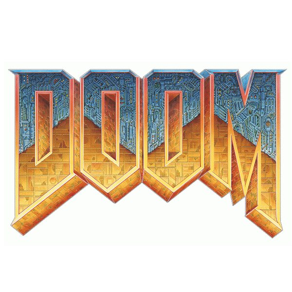

  

  <h3 align="center">CDOOM</h3>

  

   A (bad) attempt to recreate DOOM in C with SDL2
     
  

## Table of contents

- [Brief Description](#quick-start)
- [Creators](#project-creators)

## Brief Description
A side project which involves making life just that little bit more difficult by choosing to recreate DOOM in C.
If you know anything about the complexity of DOOM from a programming standpoint, you can see this won't be easy..

## Project Collaborators

**Conor Cowley** (Developer)

- <https://github.com/ccowley03>

